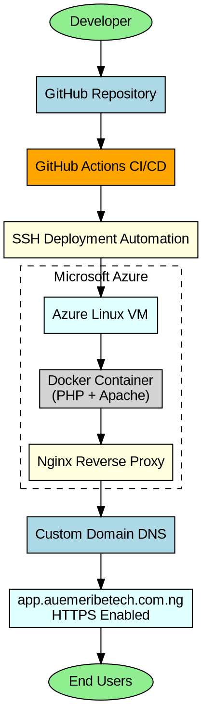

DAY 5 =# End-to-End DevOps Deployment (Docker + Terraform + CI/CD + Custom Domain)

## Azure VM + Docker + Terraform + GitHub Actions + HTTPS

---

# Project Overview

This project demonstrates a production-ready DevOps deployment pipeline for an existing PHP application using:

- Docker (PHP + Apache)
- Terraform Infrastructure as Code (IaC)
- Azure Virtual Machine
- GitHub Actions CI/CD
- SSH Deployment Automation
- Custom Domain Integration
- HTTPS with Certbot + Nginx

The goal is to fully automate deployment from GitHub to a live production environment using modern DevOps practices.

---

# Real-World Scenario

You are working as a Junior DevOps Engineer at Techie Hub.

The company already has an existing PHP application that is NOT containerized.

Management wants:

- The application containerized with Docker
- Infrastructure provisioned automatically
- CI/CD deployment pipeline
- Automated deployment on every code push
- Public access using a custom domain
- HTTPS enabled
- Production-ready deployment architecture

Your responsibilities include:

- Containerizing the PHP application
- Provisioning Azure infrastructure using Terraform
- Automating deployments using GitHub Actions
- Configuring custom domain DNS records
- Enabling HTTPS with SSL certificates
- Troubleshooting deployment failures

---

# Architecture Overview

```text
Developer Push
       ↓
GitHub Repository
       ↓
GitHub Actions CI/CD
       ↓
SSH Deployment Automation
       ↓
Azure Linux VM
       ↓
Docker Container (PHP + Apache)
       ↓
Nginx Reverse Proxy
       ↓
Custom Domain DNS
       ↓
app.auemeribetech.com.ng
       ↓
HTTPS Secure Application
       ↓
End Users
```

---

# Project Structure


---

# Technologies Used

- Microsoft Azure
- Azure CLI
- Terraform
- Docker
- GitHub Actions
- Ubuntu Linux
- Nginx
- Certbot SSL
- SSH Automation
- PHP
- Apache Web Server
- Graphviz

---

# Prerequisites

Before starting, ensure you have:

- Azure account
- GitHub account
- VS Code installed
- Docker Desktop installed
- Terraform installed
- Azure CLI installed
- Git installed
- SSH client installed
- Domain name

Example:

```text
auemeribetech.com.ng
```

---

# PHASE 0 — PREPARE LOCAL ENVIRONMENT

---

## Step 1 — Install Azure CLI

Mac:

```bash
brew update && brew install azure-cli
```

Verify:

```bash
az version
```

---

## Step 2 — Install Terraform

```bash
brew tap hashicorp/tap
brew install hashicorp/tap/terraform
```

Verify:

```bash
terraform version
```

---

## Step 3 — Install Docker Desktop

Download:

```text
https://www.docker.com/products/docker-desktop/
```

Start Docker Desktop.

Verify:

```bash
docker --version
```

---

## Step 4 — Install Graphviz

```bash
brew install graphviz
```

Verify:

```bash
dot -V
```

---

# PHASE 1 — PREPARE EXISTING PHP APPLICATION

---

## Step 5 — Download Existing PHP Application

Download:

```text
https://drive.google.com/drive/folders/1V3qwGMDSoR7hR24_mIpnNLe-3Ch3CQqx?usp=sharing
```

Extract the ZIP file.

---

## Step 6 — Create Project Folder

```bash
mkdir devops-deployment
cd devops-deployment
```

Move extracted PHP app into:

```text
charitize/
```

---

## Step 7 — Create Dockerfile

Create:

```text
charitize/Dockerfile
```

Add:

```dockerfile
FROM php:8.2-apache

WORKDIR /var/www/html

COPY . /var/www/html

EXPOSE 80
```

---

## Step 8 — Test Docker Locally

Inside:

```text
charitize/
```

Run:

```bash
docker build -t php-app .
```


Run container:

```bash
docker run -d -p 8080:80 php-app
```

Open browser:

```text
http://localhost:8080
```

---

# PHASE 2 — PUSH PROJECT TO GITHUB

---

## Step 9 — Initialize Git Repository

```bash
git init
git add .
git commit -m "Initial commit - PHP app + Terraform + CI/CD"
```

---

## Step 10 — Create GitHub Repository

Go to GitHub:

```text
New Repository
```

Repository name:

```text
devops-deployment
```

---

## Step 11 — Connect Local Repository

```bash
git remote add origin https://github.com/YOUR_USERNAME/devops-deployment.git

git branch -M main

git push -u origin main
```

---

# PHASE 3 — CONFIGURE AZURE INFRASTRUCTURE

---

## Step 12 — Login to Azure

```bash
az login
```

---

## Step 13 — Create Terraform Folder

```bash
mkdir terraform
cd terraform
```

Create:

```text
main.tf
```

---

## Step 14 — Add Terraform Configuration

Paste into:

```text
terraform/main.tf
```

```terraform
provider "azurerm" {
  features {}
}

resource "azurerm_resource_group" "rg" {
  name     = "rg-php-devops"
  location = "West Europe"
}

resource "azurerm_virtual_network" "vnet" {
  name                = "vnet-php"
  address_space       = ["10.0.0.0/16"]
  location            = azurerm_resource_group.rg.location
  resource_group_name = azurerm_resource_group.rg.name
}

resource "azurerm_subnet" "subnet" {
  name                 = "subnet-php"
  resource_group_name  = azurerm_resource_group.rg.name
  virtual_network_name = azurerm_virtual_network.vnet.name
  address_prefixes     = ["10.0.1.0/24"]
}

resource "azurerm_network_security_group" "nsg" {
  name                = "nsg-php"
  location            = azurerm_resource_group.rg.location
  resource_group_name = azurerm_resource_group.rg.name

  security_rule {
    name                       = "SSH"
    priority                   = 1001
    direction                  = "Inbound"
    access                     = "Allow"
    protocol                   = "Tcp"
    source_port_range          = "*"
    destination_port_range     = "22"
    source_address_prefix      = "*"
    destination_address_prefix = "*"
  }

  security_rule {
    name                       = "HTTP"
    priority                   = 1002
    direction                  = "Inbound"
    access                     = "Allow"
    protocol                   = "Tcp"
    source_port_range          = "*"
    destination_port_range     = "80"
    source_address_prefix      = "*"
    destination_address_prefix = "*"
  }

  security_rule {
    name                       = "HTTPS"
    priority                   = 1003
    direction                  = "Inbound"
    access                     = "Allow"
    protocol                   = "Tcp"
    source_port_range          = "*"
    destination_port_range     = "443"
    source_address_prefix      = "*"
    destination_address_prefix = "*"
  }

  security_rule {
    name                       = "AllowDocker"
    priority                   = 1004
    direction                  = "Inbound"
    access                     = "Allow"
    protocol                   = "Tcp"
    source_port_range          = "*"
    destination_port_range     = "3000"
    source_address_prefix      = "*"
    destination_address_prefix = "*"
  }
}

resource "azurerm_public_ip" "pip" {
  name                = "php-public-ip"
  location            = azurerm_resource_group.rg.location
  resource_group_name = azurerm_resource_group.rg.name
  allocation_method   = "Static"
}

resource "azurerm_network_interface" "nic" {
  name                = "php-nic"
  location            = azurerm_resource_group.rg.location
  resource_group_name = azurerm_resource_group.rg.name

  ip_configuration {
    name                          = "internal"
    subnet_id                     = azurerm_subnet.subnet.id
    private_ip_address_allocation = "Dynamic"
    public_ip_address_id          = azurerm_public_ip.pip.id
  }
}

resource "azurerm_network_interface_security_group_association" "assoc" {
  network_interface_id      = azurerm_network_interface.nic.id
  network_security_group_id = azurerm_network_security_group.nsg.id
}

resource "azurerm_linux_virtual_machine" "vm" {
  name                = "php-vm"
  resource_group_name = azurerm_resource_group.rg.name
  location            = azurerm_resource_group.rg.location
  size                = "Standard_B1s"
  admin_username      = "azureuser"

  network_interface_ids = [azurerm_network_interface.nic.id]

  admin_ssh_key {
    username   = "azureuser"
    public_key = file("~/.ssh/id_rsa.pub")
  }

  os_disk {
    caching              = "ReadWrite"
    storage_account_type = "Standard_LRS"
  }

  source_image_reference {
    publisher = "Canonical"
    offer     = "0001-com-ubuntu-server-jammy"
    sku       = "22_04-lts"
    version   = "latest"
  }
}
```

---

## Step 15 — Initialize Terraform

```bash
terraform init
```

---

## Step 16 — Validate Terraform

```bash
terraform validate
```

---

## Step 17 — View Terraform Plan

```bash
terraform plan
```

---

## Step 18 — Provision Azure Infrastructure

```bash
terraform apply
```

Type:

```text
yes
```

---

# PHASE 4 — CONNECT TO AZURE VM

---

## Step 19 — Get Azure VM Public IP

```bash
az vm show -d \
-g rg-php-devops \
-n php-vm \
--query publicIps \
-o tsv
```

---

## Step 20 — SSH Into Azure VM

```bash
ssh azureuser@YOUR_PUBLIC_IP
```

Example:

```bash
ssh azureuser@20.40.50.60
```

---

# PHASE 5 — INSTALL DOCKER ON VM

---

## Step 21 — Update Ubuntu Server

```bash
sudo apt update && sudo apt upgrade -y
```

---

## Step 22 — Install Docker

```bash
sudo apt install docker.io -y
```

Enable Docker:

```bash
sudo systemctl enable docker
```

Start Docker:

```bash
sudo systemctl start docker
```

---

## Step 23 — Verify Docker

```bash
docker --version
```

---

## Step 24 — Add User to Docker Group

```bash
sudo usermod -aG docker azureuser
```

Reconnect SSH afterward.

---

# PHASE 6 — CONFIGURE CI/CD PIPELINE

---

## Step 25 — Create Workflow Folder

```bash
mkdir -p .github/workflows
```

Create:

```text
.github/workflows/deploy.yml
```

---

## Step 26 — Add GitHub Actions Workflow

Paste into:

```text
.github/workflows/deploy.yml
```

```yaml
name: Deploy PHP App

on:
  push:
    branches:
      - main

jobs:
  deploy:
    runs-on: ubuntu-latest

    steps:
    - uses: actions/checkout@v3

    - name: Deploy to VM
      uses: appleboy/ssh-action@v0.1.6
      with:
        host: ${{ secrets.VM_HOST }}
        username: ${{ secrets.VM_USER }}
        key: ${{ secrets.SSH_PRIVATE_KEY }}
        script: |
          sudo rm -rf devops-deployment
          sudo git clone https://github.com/YOUR_USERNAME/devops-deployment.git
          cd devops-deployment/charitize
          sudo docker build -t php-app .
          sudo docker stop php-app || true
          sudo docker rm php-app || true
          sudo docker run -d -p 3000:80 --name php-app php-app
```

---

# PHASE 7 — CREATE .gitignore

---

## Step 27 — Create .gitignore

Create:

```text
.gitignore
```

Add:

```gitignore
# Terraform
.terraform/
*.tfstate
*.tfstate.*
crash.log

# Sensitive Files
*.pem
*.key

# Logs
*.log

# macOS
.DS_Store

# Windows
Thumbs.db

# Node
node_modules/

# VS Code
.vscode/

# Environment Variables
.env
```

---

# PHASE 8 — CONFIGURE GITHUB SECRETS

---

## Step 28 — Add GitHub Secrets

Go to:

```text
GitHub Repository
→ Settings
→ Secrets and Variables
→ Actions
→ New Repository Secret
```

Add:

### VM_HOST

```text
YOUR_VM_PUBLIC_IP
```

### VM_USER

```text
azureuser
```

### SSH_PRIVATE_KEY

View private key:

```bash
cat ~/.ssh/id_rsa
```

Copy entire output and paste into GitHub Secret.

---

# PHASE 9 — TEST MANUAL DEPLOYMENT

---

## Step 29 — Clone Repository on VM

```bash
git clone https://github.com/YOUR_USERNAME/devops-deployment.git
```

---

## Step 30 — Build Docker Image

```bash
cd devops-deployment/charitize

sudo docker build -t php-app .
```

---

## Step 31 — Run Docker Container

```bash
sudo docker run -d -p 3000:80 --name php-app php-app
```

Verify:

```bash
sudo docker ps
```

---

## Step 32 — Test Application

Open:

```text
http://YOUR_VM_PUBLIC_IP:3000
```

---

# PHASE 10 — CONFIGURE CUSTOM DOMAIN DNS

---

## Step 33 — Configure DNS Record

Go to your domain registrar dashboard:

- Namecheap
- QServers
- GoDaddy
- Cloudflare

Create:

```text
Type: A
Host: app
Value: YOUR_VM_PUBLIC_IP
TTL: Automatic
```

---

## Step 34 — Verify DNS

Open:

```text
http://app.auemeribetech.com.ng
```

---

# PHASE 11 — CONFIGURE NGINX REVERSE PROXY

---

## Step 35 — Install Nginx

```bash
sudo apt install nginx -y
```

---

## Step 36 — Configure Reverse Proxy

Edit:

```bash
sudo nano /etc/nginx/sites-available/default
```

Replace contents with:

```nginx
server {

    listen 80;

    server_name app.auemeribetech.com.ng;

    location / {

        proxy_pass http://127.0.0.1:3000;

        proxy_set_header Host $host;

        proxy_set_header X-Real-IP $remote_addr;
    }
}
```

---

## Step 37 — Restart Nginx

```bash
sudo systemctl restart nginx
```

Verify:

```bash
sudo systemctl status nginx
```

---

# PHASE 12 — ENABLE HTTPS

---

## Step 38 — Install Certbot

```bash
sudo apt install certbot python3-certbot-nginx -y
```

---

## Step 39 — Generate SSL Certificate

```bash
sudo certbot --nginx -d app.auemeribetech.com.ng
```

Choose:

```text
Redirect HTTP to HTTPS
```

---

## Step 40 — Verify HTTPS

Open:

```text
https://app.auemeribetech.com.ng
```

---

# PHASE 13 — TEST FULL CI/CD PIPELINE

---

## Step 41 — Make Application Change

Edit:

```text
index.php
```

Add:

```text
Your Techie Hub
```

---

## Step 42 — Push Changes

```bash
git add .

git commit -m "Testing CI/CD deployment"

git push origin main
```

---

## Step 43 — Verify GitHub Actions

Go to:

```text
GitHub Repository
→ Actions
```

Watch pipeline execute automatically.

---

## Step 44 — Verify Live Application

Open:

```text
https://app.auemeribetech.com.ng
```

---

# PHASE 14 — DEVELOP PROJECT ARCHITECTURE DIAGRAM

---

## Step 45 — Create Documentation Folder

```bash
mkdir -p docs/achitecture-diagram.dot
touch docs/achitecture-diagram.dot
```

---

## Step 46 — Create Architecture Code File

Create:

```text
docs/architecture.dot
```

---

## Step 47 — Add Graphviz Architecture Code

Paste into:

```text
docs/architecture.dot
```



---

## Step 48 — Generate Architecture Diagram

Generate PNG:

```bash
dot -Tpng docs/architecture-diagram.dot -o docs/architecture-diagram.png
```

Generate SVG:

```bash
dot -Tsvg docs/architecture-diagram.dot -o screenshots/architecture-creation-svg-version.svg
```

---

## Step 49 — Open Architecture Diagram

```bash
open docs/architecture.png
```

---

## Step 50 — Add Diagram to README

```markdown
# Architecture Diagram
```

---

## Step 51 — Push Architecture Updates

```bash
git add .

git commit -m "Added architecture diagram"

git push origin main
```

---

# Common Errors and Fixes

---

## ERROR 1 — Terraform Large Files on GitHub

Fix:

```bash
git rm -r --cached terraform/.terraform
```

Then:

```bash
git add .
git commit -m "Remove terraform cache"
git push
```

---

## ERROR 2 — SSH Authentication Failure

Use PRIVATE key:

```bash
cat ~/.ssh/id_rsa
```

NOT:

```text
id_rsa.pub
```

---

## ERROR 3 — Docker Permission Denied

Fix:

```bash
sudo usermod -aG docker azureuser
```

Reconnect SSH.

---

## ERROR 4 — Port Conflict

Fix:

```bash
sudo docker run -d -p 3000:80 --name php-app php-app
```

Use Nginx reverse proxy.

---

## ERROR 5 — Docker Not Found

Fix:

```bash
sudo apt install docker.io -y
sudo systemctl start docker
```

---

# Final Outcome

You successfully built:

- Dockerized PHP Application
- Azure Infrastructure with Terraform
- Automated CI/CD Pipeline
- GitHub Actions Deployment
- SSH Automation
- Custom Domain Integration
- HTTPS Secure Application
- Production Reverse Proxy Architecture

---

# Cleanup Resources

Destroy Terraform infrastructure:

```bash
cd terraform

terraform destroy
```

Delete Azure watcher resource group:

```bash
az group delete -n NetworkWatcherRG -y
```

---

# Author

Anthony Uchenna Emeribe

Cloud / DevOps Engineer