DAY 5 =# End-to-End DevOps Deployment (Docker + Terraform + CI/CD + Custom Domain)

## Azure VM + Docker + Terraform + GitHub Actions + HTTPS

---

# Project Overview

This project demonstrates a production-ready DevOps deployment pipeline for an existing PHP application using:

- Docker (PHP + Apache)
- Terraform Infrastructure as Code (IaC)
- Azure Virtual Machine
- GitHub Actions CI/CD
- SSH Deployment Automation
- Custom Domain Integration
- HTTPS with Certbot + Nginx

The goal is to fully automate deployment from GitHub to a live production environment using modern DevOps practices.

---

# Real-World Scenario

You are working as a Junior DevOps Engineer at Techie Hub.

The company already has an existing PHP application that is NOT containerized.

Management wants:

- The application containerized with Docker
- Infrastructure provisioned automatically
- CI/CD deployment pipeline
- Automated deployment on every code push
- Public access using a custom domain
- HTTPS enabled
- Production-ready deployment architecture

Your responsibilities include:

- Containerizing the PHP application
- Provisioning Azure infrastructure using Terraform
- Automating deployments using GitHub Actions
- Configuring custom domain DNS records
- Enabling HTTPS with SSL certificates
- Troubleshooting deployment failures

---

# Architecture Overview

```text
Developer Push
       ↓
GitHub Repository
       ↓
GitHub Actions CI/CD
       ↓
SSH Deployment Automation
       ↓
Azure Linux VM
       ↓
Docker Container (PHP + Apache)
       ↓
Nginx Reverse Proxy
       ↓
Custom Domain DNS
       ↓
app.auemeribetech.com.ng
       ↓
HTTPS Secure Application
       ↓
End Users
```

---

# Project Structure

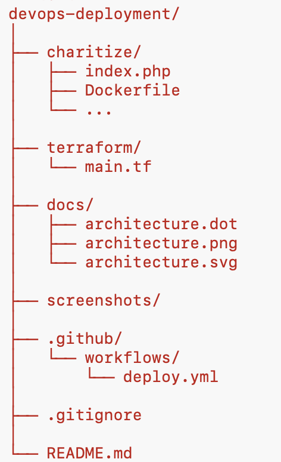

---

# Technologies Used

- Microsoft Azure
- Azure CLI
- Terraform
- Docker
- GitHub Actions
- Ubuntu Linux
- Nginx
- Certbot SSL
- SSH Automation
- PHP
- Apache Web Server
- Graphviz

---

# Prerequisites

Before starting, ensure you have:

- Azure account
- GitHub account
- VS Code installed
- Docker Desktop installed
- Terraform installed
- Azure CLI installed
- Git installed
- SSH client installed
- Domain name

Example:

```text
auemeribetech.com.ng
```

---

# PHASE 0 — PREPARE LOCAL ENVIRONMENT

---

## Step 1 — Install Azure CLI

Mac:

```bash
brew update && brew install azure-cli
```

Verify:

```bash
az version
```
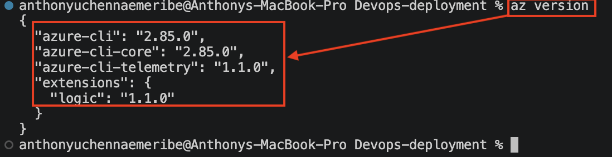
---

## Step 2 — Install Terraform

```bash
brew tap hashicorp/tap
brew install hashicorp/tap/terraform
```

Verify:

```bash
terraform version
```

---

## Step 3 — Install Docker Desktop

Download:

```text
https://www.docker.com/products/docker-desktop/
```

Start Docker Desktop.

Verify:

```bash
docker --version
```
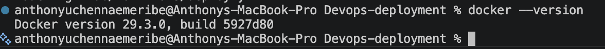
---

## Step 4 — Install Graphviz
1. Run:
```bash
brew install graphviz
```

2. Verify:

```bash
dot -V
```
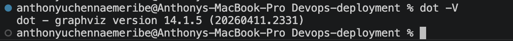
---

# PHASE 1 — PREPARE EXISTING PHP APPLICATION

---

## Step 5 — Download Existing PHP Application

Download:

```text
https://drive.google.com/drive/folders/1V3qwGMDSoR7hR24_mIpnNLe-3Ch3CQqx?usp=sharing
```

Extract the ZIP file.

---

## Step 6 — Create Project Folder

```bash
mkdir devops-deployment
cd devops-deployment
```

Move extracted PHP app into:

```text
charitize/
```

---

## Step 7 — Create Dockerfile

Create:

```text
charitize/Dockerfile
```

Add:

```dockerfile
FROM php:8.2-apache

WORKDIR /var/www/html

COPY . /var/www/html

EXPOSE 80
```
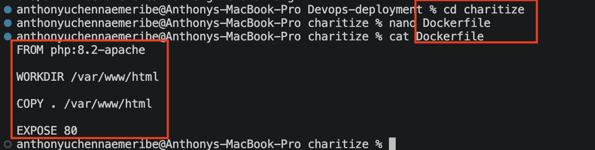
---

## Step 8 — Test Docker Locally

Inside:

```text
charitize/
```

Run:

```bash
docker build -t php-app .
```
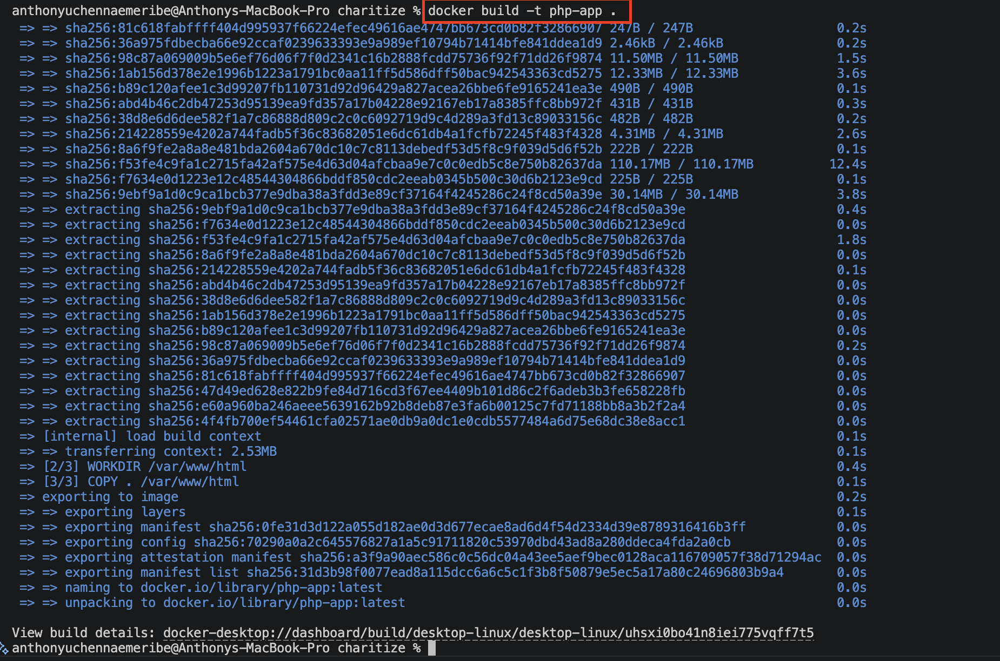

Run container:

```bash
docker run -d -p 8080:80 php-app
```
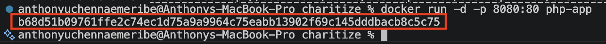
Open browser:

```text
http://localhost:8080
```

---

# PHASE 2 — PUSH PROJECT TO GITHUB

---

## Step 9 — Initialize Git Repository

```bash
git init
git add .
git commit -m "Initial commit - PHP app + Terraform + CI/CD"
```
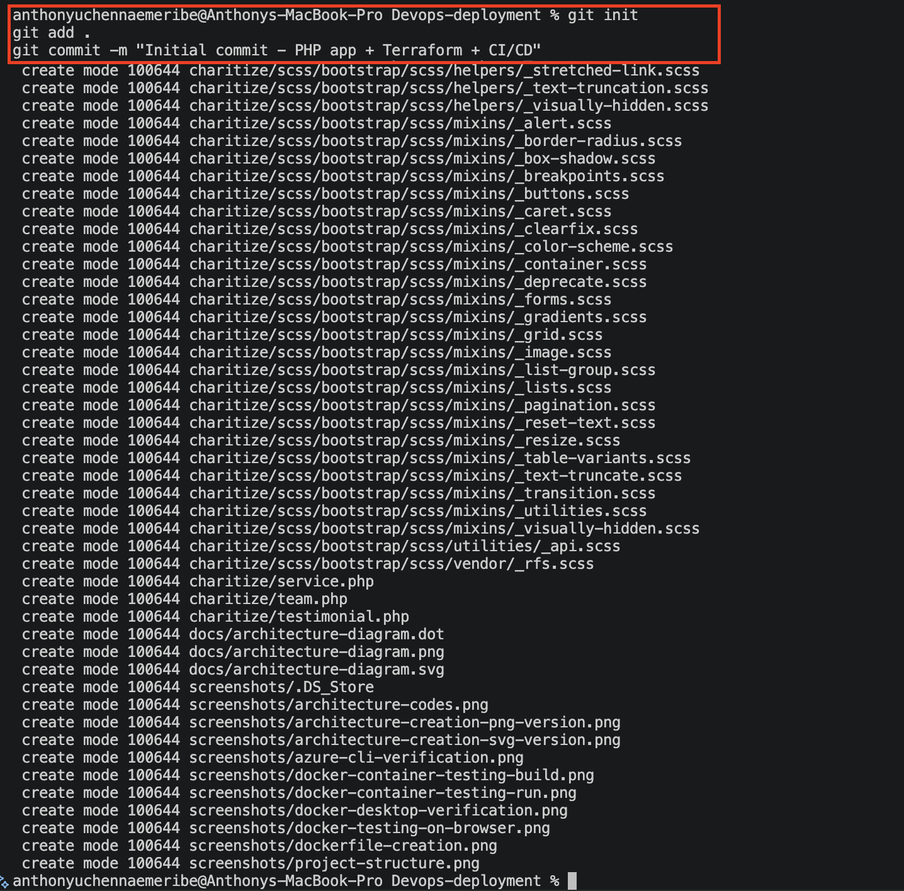
---

## Step 10 — Change Brancch Name from Master to Main

1. Confirm Current Branch:

```bash
git branch
```


2. Change GitHub Branch Name:

```bash
git branch -M main
```
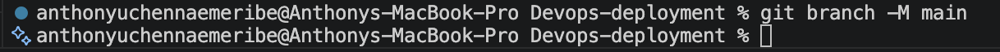
---

## Step 11 — Create and Push Repository
1. Create repo
```bash
gh repo create devops-deployment --public --source=. --remote=origin --push
```
This single command:

* creates the GitHub repository
* connects remote origin
* pushes your local code
* sets upstream automatically

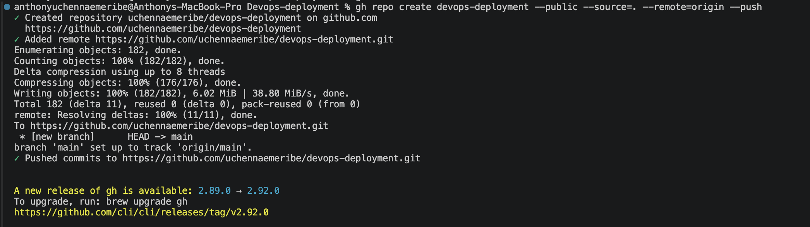

2. Confirm/verify the correct created repository where the resources will be push
```bash
git remote -v
```
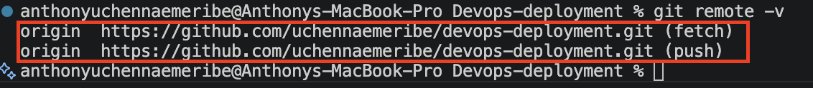
---

# PHASE 3 — CONFIGURE AZURE INFRASTRUCTURE

---

## Step 12 — Login to Azure

```bash
az login
```
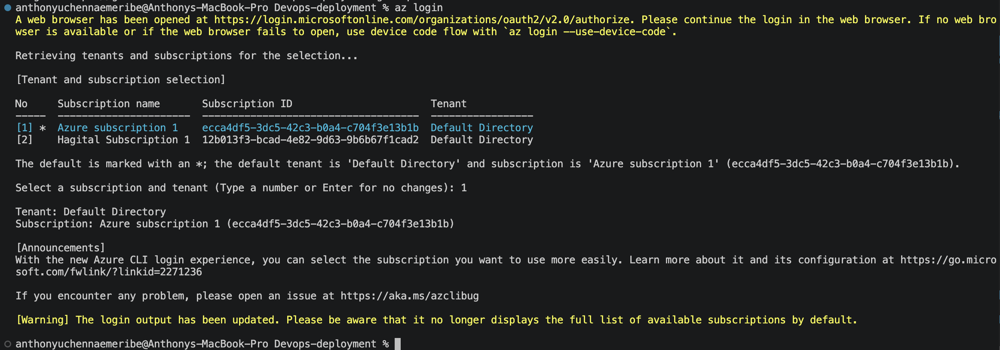
---

## Step 13 — Create Terraform Folder

```bash
mkdir terraform
cd terraform
```
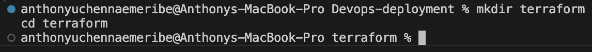
Create:

```bash
nano main.tf
```

---

## Step 14 — Add Terraform Configuration

Paste into:

```text
terraform/main.tf
```

```terraform
provider "azurerm" {
  features {}
}

# =========================================
# Resource Group
# =========================================

resource "azurerm_resource_group" "rg" {
  name     = "rg-php-devops"
  location = "West US 3"
}

# =========================================
# Virtual Network
# =========================================

resource "azurerm_virtual_network" "vnet" {
  name                = "vnet-php"
  address_space       = ["10.0.0.0/16"]
  location            = azurerm_resource_group.rg.location
  resource_group_name = azurerm_resource_group.rg.name
}

# =========================================
# Subnet
# =========================================

resource "azurerm_subnet" "subnet" {
  name                 = "subnet-php"
  resource_group_name  = azurerm_resource_group.rg.name
  virtual_network_name = azurerm_virtual_network.vnet.name
  address_prefixes     = ["10.0.1.0/24"]
}

# =========================================
# Network Security Group
# =========================================

resource "azurerm_network_security_group" "nsg" {
  name                = "nsg-php"
  location            = azurerm_resource_group.rg.location
  resource_group_name = azurerm_resource_group.rg.name

  # SSH
  security_rule {
    name                       = "SSH"
    priority                   = 1001
    direction                  = "Inbound"
    access                     = "Allow"
    protocol                   = "Tcp"
    source_port_range          = "*"
    destination_port_range     = "22"
    source_address_prefix      = "*"
    destination_address_prefix = "*"
  }

  # HTTP
  security_rule {
    name                       = "HTTP"
    priority                   = 1002
    direction                  = "Inbound"
    access                     = "Allow"
    protocol                   = "Tcp"
    source_port_range          = "*"
    destination_port_range     = "80"
    source_address_prefix      = "*"
    destination_address_prefix = "*"
  }

  # HTTPS
  security_rule {
    name                       = "HTTPS"
    priority                   = 1003
    direction                  = "Inbound"
    access                     = "Allow"
    protocol                   = "Tcp"
    source_port_range          = "*"
    destination_port_range     = "443"
    source_address_prefix      = "*"
    destination_address_prefix = "*"
  }

  # Docker Application Port
  security_rule {
    name                       = "AllowDocker"
    priority                   = 1004
    direction                  = "Inbound"
    access                     = "Allow"
    protocol                   = "Tcp"
    source_port_range          = "*"
    destination_port_range     = "3000"
    source_address_prefix      = "*"
    destination_address_prefix = "*"
  }
}

# =========================================
# Public IP
# =========================================

resource "azurerm_public_ip" "pip" {
  name                = "php-public-ip"
  location            = azurerm_resource_group.rg.location
  resource_group_name = azurerm_resource_group.rg.name
  allocation_method   = "Static"
}

# =========================================
# Network Interface
# =========================================

resource "azurerm_network_interface" "nic" {
  name                = "php-nic"
  location            = azurerm_resource_group.rg.location
  resource_group_name = azurerm_resource_group.rg.name

  depends_on = [
    azurerm_subnet.subnet
  ]

  ip_configuration {
    name                          = "internal"
    subnet_id                     = azurerm_subnet.subnet.id
    private_ip_address_allocation = "Dynamic"
    public_ip_address_id          = azurerm_public_ip.pip.id
  }
}

# =========================================
# Attach NSG to NIC
# =========================================

resource "azurerm_network_interface_security_group_association" "assoc" {
  network_interface_id      = azurerm_network_interface.nic.id
  network_security_group_id = azurerm_network_security_group.nsg.id
}

# =========================================
# Linux Virtual Machine
# =========================================

resource "azurerm_linux_virtual_machine" "vm" {
  name                = "php-vm"
  resource_group_name = azurerm_resource_group.rg.name
  location            = azurerm_resource_group.rg.location
  size                = "Standard_D2s_v3"
  admin_username      = "azureuser"

  network_interface_ids = [
    azurerm_network_interface.nic.id
  ]

  depends_on = [
    azurerm_network_interface_security_group_association.assoc
  ]

  admin_ssh_key {
    username   = "azureuser"
    public_key = file("~/.ssh/id_rsa.pub")
  }

  os_disk {
    caching              = "ReadWrite"
    storage_account_type = "Standard_LRS"
  }

  source_image_reference {
    publisher = "Canonical"
    offer     = "0001-com-ubuntu-server-jammy"
    sku       = "22_04-lts"
    version   = "latest"
  }
}

# =========================================
# Outputs
# =========================================

output "public_ip" {
  value = azurerm_public_ip.pip.ip_address
}

output "vm_name" {
  value = azurerm_linux_virtual_machine.vm.name
}

output "resource_group" {
  value = azurerm_resource_group.rg.name
}
```
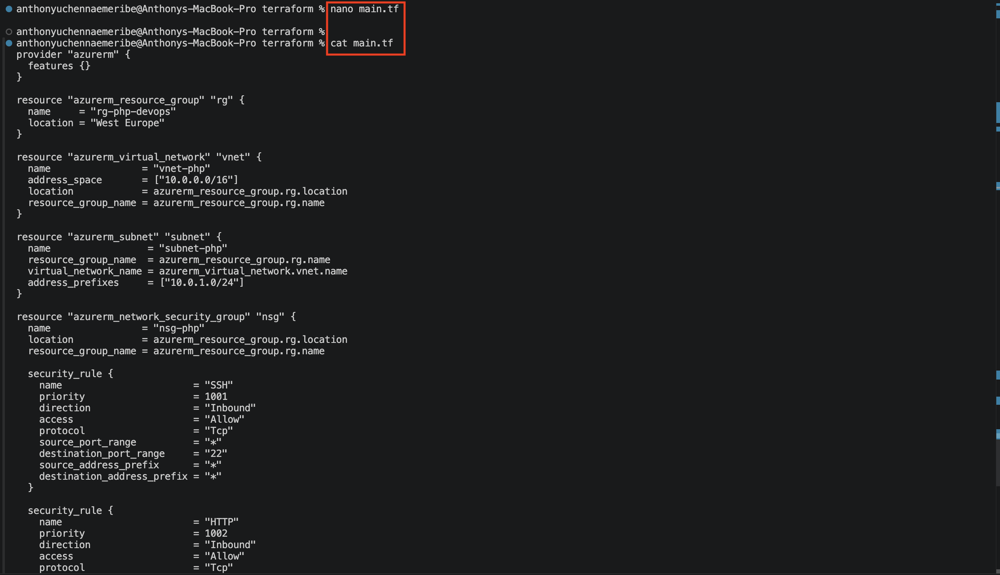
---

## Step 15 — Initialize Terraform

```bash
terraform init
```
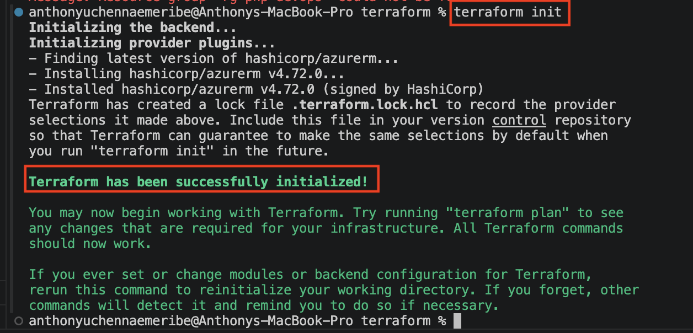
---

## Step 16 — Validate Terraform

```bash
terraform validate
```
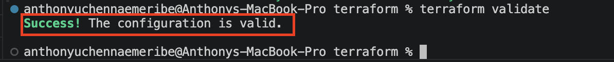
---

## Step 17 — View and Inspect Terraform Plan
1. Run:
```bash
terraform plan -out=tfplan
```
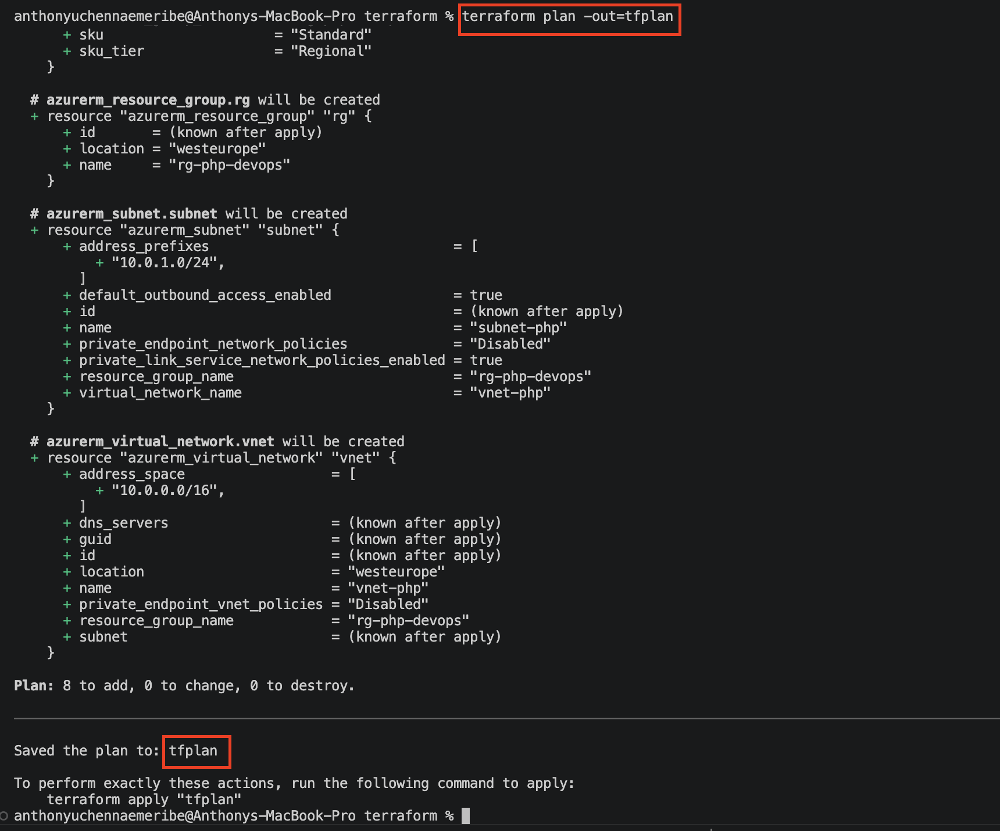

2. This creates a file, which contains exactly what Terraform will do:
```text
tfplan
```
3. Inspect plan
```bash
terraform show tfplan
```
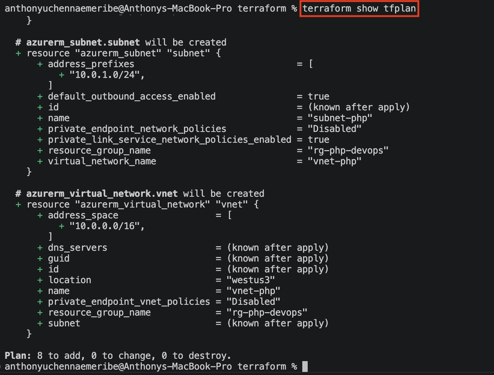
---

## Step 18 — Provision Azure Infrastructure

```bash
terraform apply tfplan
```

Type:

```text
yes
```
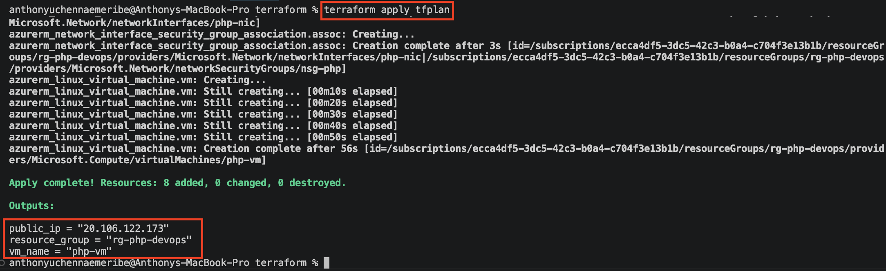
---

# PHASE 4 — CONNECT TO AZURE VM

---

## Step 19 — Get Azure VM Public IP
1. Method 1
```bash
terraform output public_ip
```
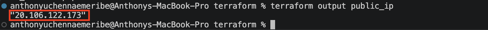
2. Method 2
```bash
az vm show -d -g rg-php-devops -n php-vm --query publicIps -o tsv
```
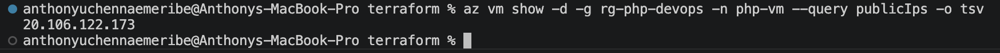
---

## Step 20 — SSH Into Azure VM

```bash
ssh azureuser@YOUR_PUBLIC_IP
```

Example:

```bash
ssh azureuser@20.106.122.173
```
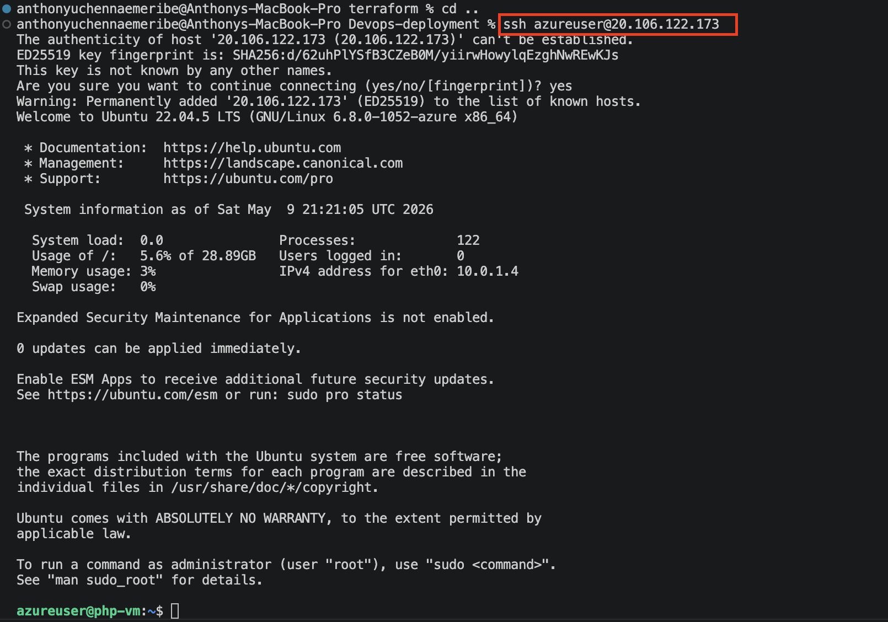

---

# PHASE 5 — INSTALL DOCKER ON VM

---

## Step 21 — Update Ubuntu Server

```bash
sudo apt update && sudo apt upgrade -y
```
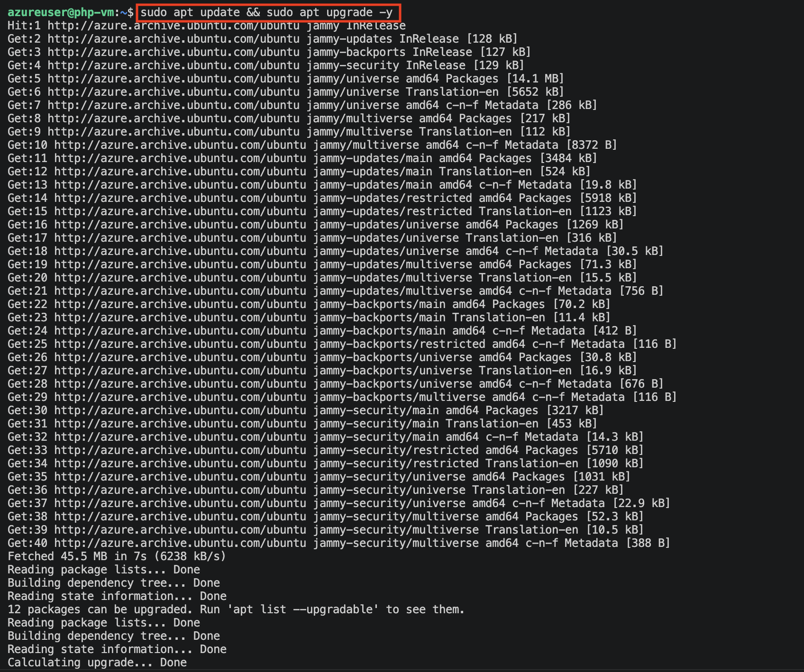
---

## Step 22 — Install Docker
1. Run to install:
```bash
sudo apt install docker.io -y
```
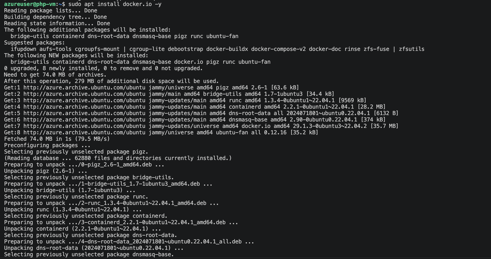

2. Enable Docker:

```bash
sudo systemctl enable docker
```
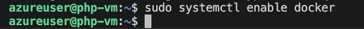

2. Start Docker:

```bash
sudo systemctl start docker
```
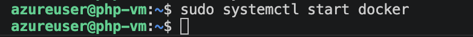
---

## Step 23 — Verify Docker
1. Run:
```bash
docker --version
```
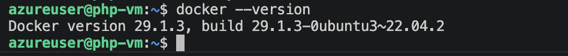
---

## Step 24 — Add User to Docker Group
1. Run:
```bash
sudo usermod -aG docker azureuser
```
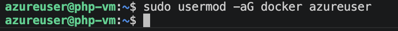

2. Reconnect SSH afterward, but exit the azure vm using:
```bash
exit
```
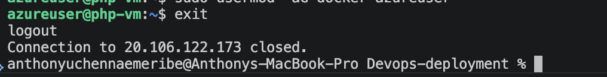
---

# PHASE 6 — CONFIGURE CI/CD PIPELINE

---

## Step 25 — Create Workflow Folder

```bash
mkdir -p .github/workflows
```

Create:

```text
.github/workflows/deploy.yml
```

---

## Step 26 — Add GitHub Actions Workflow

1. Use text editor to modify deploy.yml file:

```bash
nano .github/workflows/deploy.yml
```

```yaml
name: Deploy PHP App

on:
  push:
    branches:
      - main

jobs:
  deploy:
    runs-on: ubuntu-latest

    steps:
      - name: Checkout Repository
        uses: actions/checkout@v3

      - name: Deploy Application to Azure VM
        uses: appleboy/ssh-action@v0.1.6
        with:
          host: ${{ secrets.VM_HOST }}
          username: ${{ secrets.VM_USER }}
          key: ${{ secrets.SSH_PRIVATE_KEY }}

          script: |
            sudo rm -rf devops-deployment

            git clone https://github.com/uchennaemeribe/devops-deployment.git

            cd devops-deployment/charitize

            sudo docker stop php-app || true

            sudo docker rm php-app || true

            sudo docker rmi php-app || true

            sudo docker build --no-cache -t php-app .

            sudo docker run -d -p 3000:80 --name php-app php-app

            sudo docker ps
```
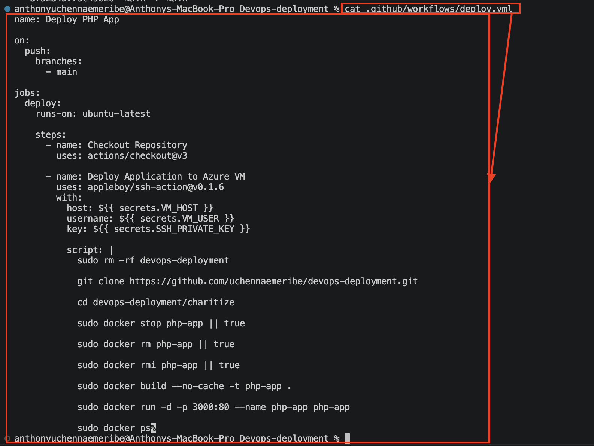
---

# PHASE 7 — CREATE .gitignore

---

## Step 27 — Create .gitignore

Create:

```bash
nano .gitignore
```

Add:

```gitignore
# Node.js
node_modules/
npm-debug.log

# Environment variables
.env

# OS files
.DS_Store
Thumbs.db

# Logs
logs/
*.log

# Terraform
terraform/.terraform/
terraform/*.tfstate
terraform/*.tfstate.backup
tfplan
*.tfplan

# SSH Keys (CRITICAL SECURITY)
*.pem
*.key

# Docker
docker-compose.override.yml

# IDE
.vscode/
.idea/
```
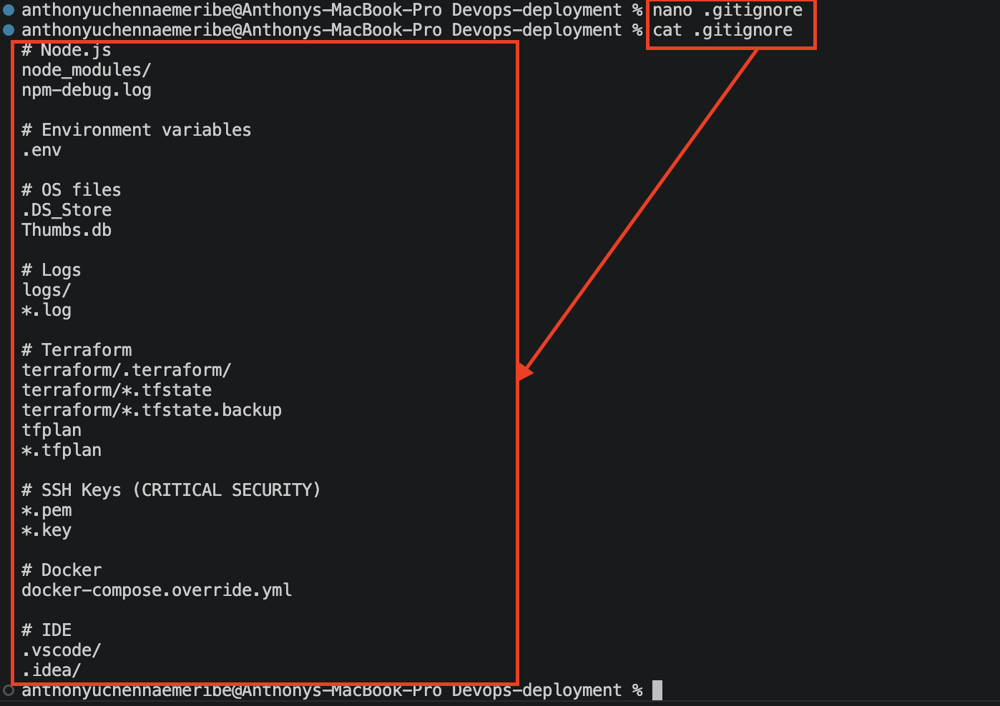
---

## PHASE 8 — CONFIGURE GITHUB SECRETS

---

## Step 28 — Generate SSH Key Pair

Move into project directory:

```bash
cd devops-deployment
```

Generate SSH key pair:

```bash
ssh-keygen -t rsa -b 4096
```

Press ENTER to accept the default save location.

The following files are created automatically:

```text
~/.ssh/id_rsa
~/.ssh/id_rsa.pub
```
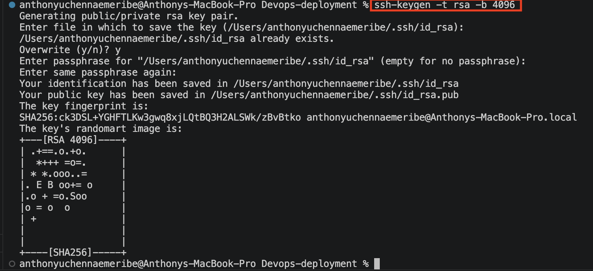
---

## Step 29 — Authenticate GitHub CLI

1. Login to GitHub CLI:

```bash
gh auth login
```
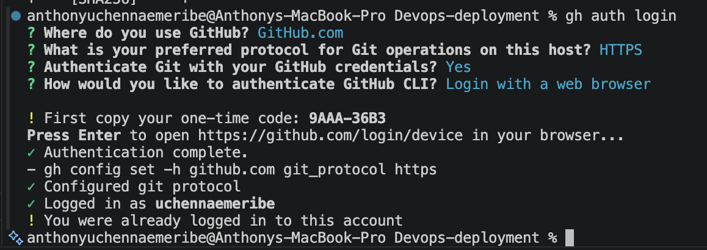

2. Verify authentication:

```bash
gh auth status
```
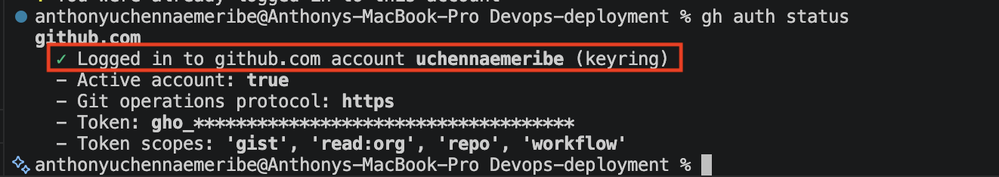
---

## Step 30 — Create GitHub Repository Secrets

1. Retrieve VM Public IP using:
```bash
cd terraform
terraform output public_ip
```
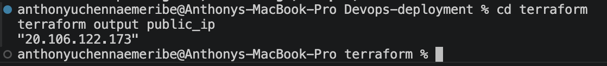

2. Create VM host secret:

```bash
gh secret set VM_HOST
```

3. Enter:

```text
YOUR_VM_PUBLIC_IP
```
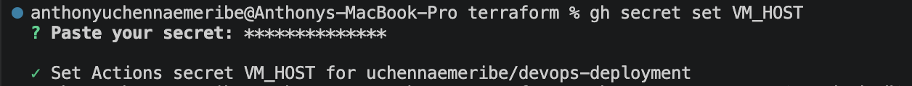

4. Alternatively create VM host secret using
```bash
gh secret set VM_HOST --body "EC2_public_IP"
```


5. Create VM username secret:

```bash
gh secret set VM_USER
```

6. Enter:

```text
azureuser
```
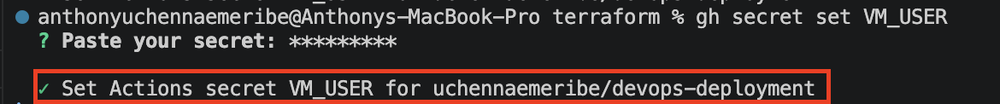

7. Alternatively creat
```bash
gh secret set VM_USER --body "azureuser"
```
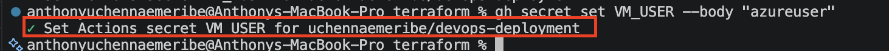

8. Create SSH private key secret without copy-and-paste:

```bash
gh secret set SSH_PRIVATE_KEY < ~/.ssh/id_rsa
```
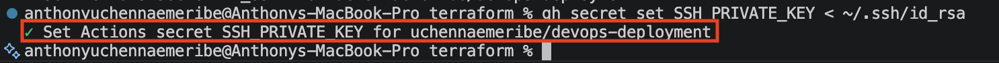
9. Optional: upload public key secret:

```bash
gh secret set VM_PUBLIC_KEY < ~/.ssh/id_rsa.pub
```

10. Verify secrets:

```bash
gh secret list
```
Expected:

```text
SSH_PRIVATE_KEY
VM_HOST
VM_PUBLIC_KEY
VM_USER
```
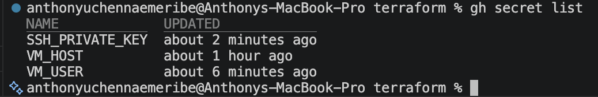
---

# PHASE 9 — TEST MANUAL DEPLOYMENT

---

## Step 31 — SSH Into Azure VM

1. Retrieve Azure VM Public IP:
```bash
cd terraform
terraform output public_ip
```


2. Connect to the Azure VM using the retrieved Public IP:

```bash
ssh azureuser@YOUR_VM_PUBLIC_IP
```

Example:

```bash
ssh azureuser@20.106.122.173
```

---

## Step 32 — Clone Repository on VM
1. Run:
```bash
git clone https://github.com/uchennaemeribe/devops-deployment.git
```
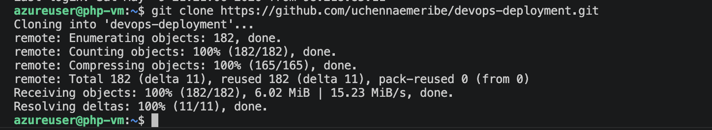

2. Move into application directory:

```bash
cd devops-deployment/charitize
```
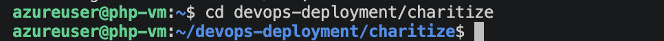
---

## Step 33 — Verify Existing Containers on Port 3000

1. Check running containers:

```bash
sudo docker ps
```

2. Check whether port 3000 is already in use:

```bash
sudo lsof -i :3000
```

3. If a container is already using port 3000, stop it:

```bash
sudo docker stop php-app
```

4. Remove the container:

```bash
sudo docker rm php-app
```

5. Verify the port is free:

```bash
sudo lsof -i :3000
```

6. No output means the port is available.

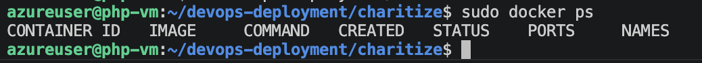
---

## Step 34 — Build Docker Image

1. Build Docker image:

```bash
sudo docker build -t php-app .
```
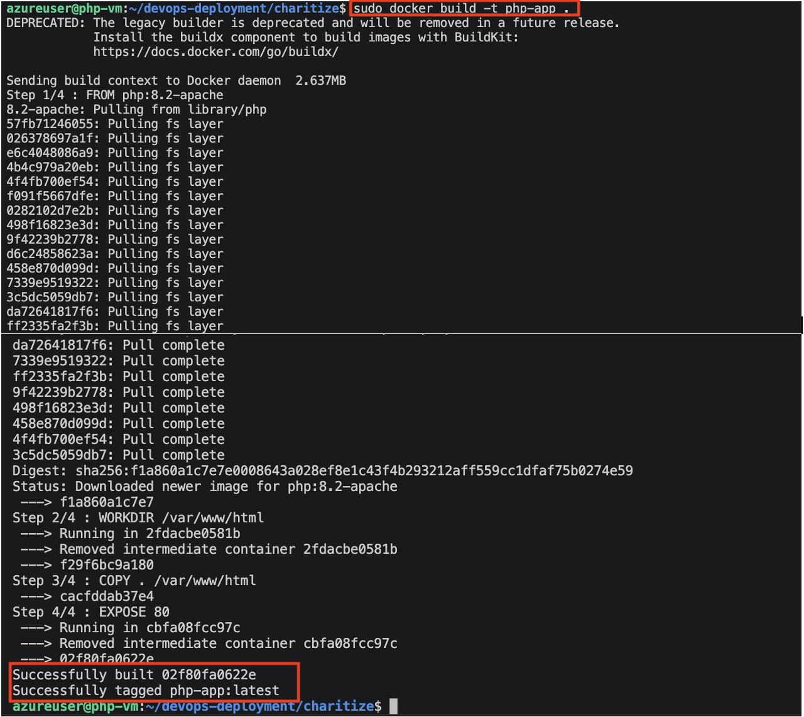

2. Verify image creation:

```bash
sudo docker images
```
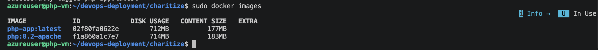
---

## Step 35 — Run Docker Container

1. Run the container:

```bash
sudo docker run -d -p 3000:80 --name php-app php-app
```
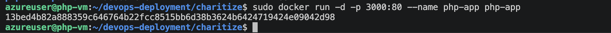

3. Verify container status:

```bash
sudo docker ps
```

Expected:
- container status should display `Up`
- port mapping should display `3000->80`

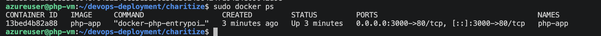
---

## Step 36 — Test Application

1. Open in browser:

```text
http://20.106.122.173:3000
```

The PHP application should now load successfully.


2. After successfully testing of the application using the browser, exit the azure vm using:
```bash
exit
```


---

# PHASE 10 — CONFIGURE CUSTOM DOMAIN DNS (AZURE DNS)

---

# Step 37 - Create Azure DNS Zone
1. Azure DNS is a separate Azure managed service, not software installed on the VM. Following exit from the azure vm, run:

```bash
az network dns zone create --resource-group rg-php-devops --name auemeribetech.com.ng
```
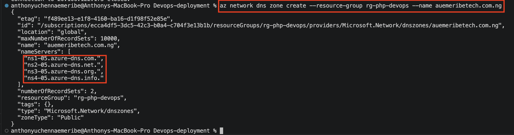
---

## Step 38 — Get Azure Nameservers

```bash
az network dns zone show --resource-group rg-php-devops --name auemeribetech.com.ng --query nameServers
```
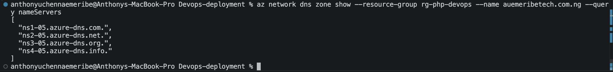
Copy the nameservers.

---

## Step 39 — Update Nameservers at Domain Registrar

1. Login to:
- QServers
2. Proceed to:
- My Domain
2. Click on:
- My Domain

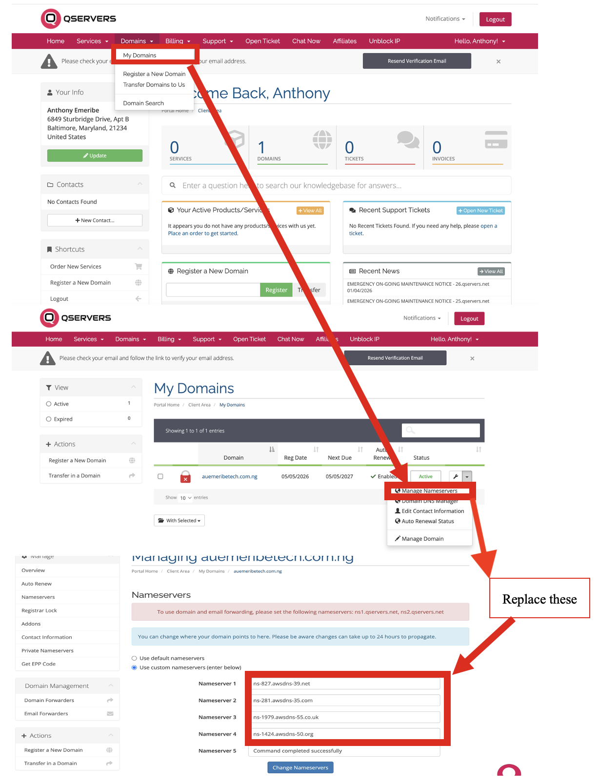

2. Replace existing nameservers with Azure nameservers.

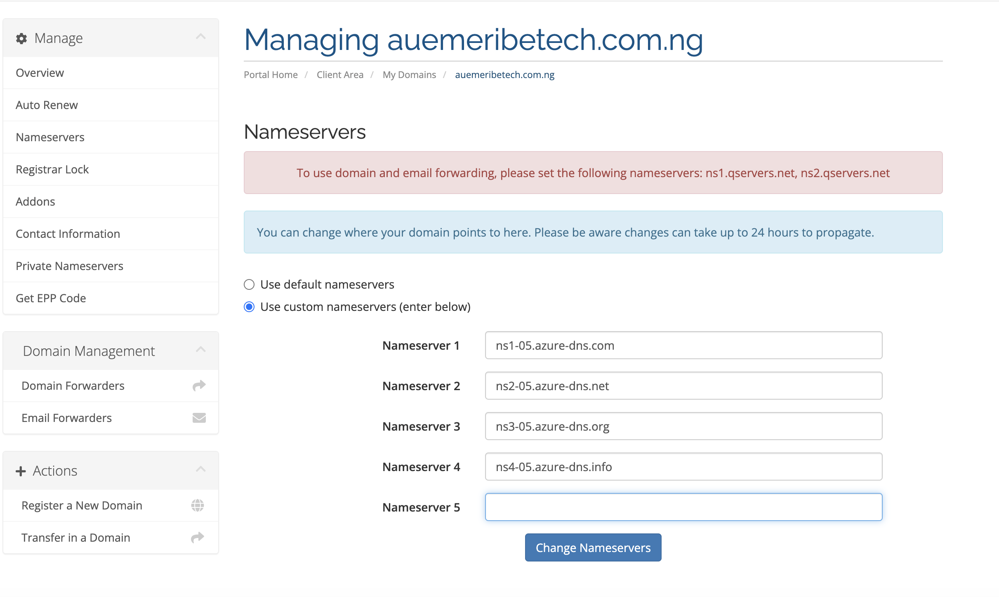

3. Wait for propagation

4. After approximately 10–15 minutes, verify that the domain is now using Azure DNS nameservers.

Run:

```bash
dig auemeribetech.com.ng NS
```
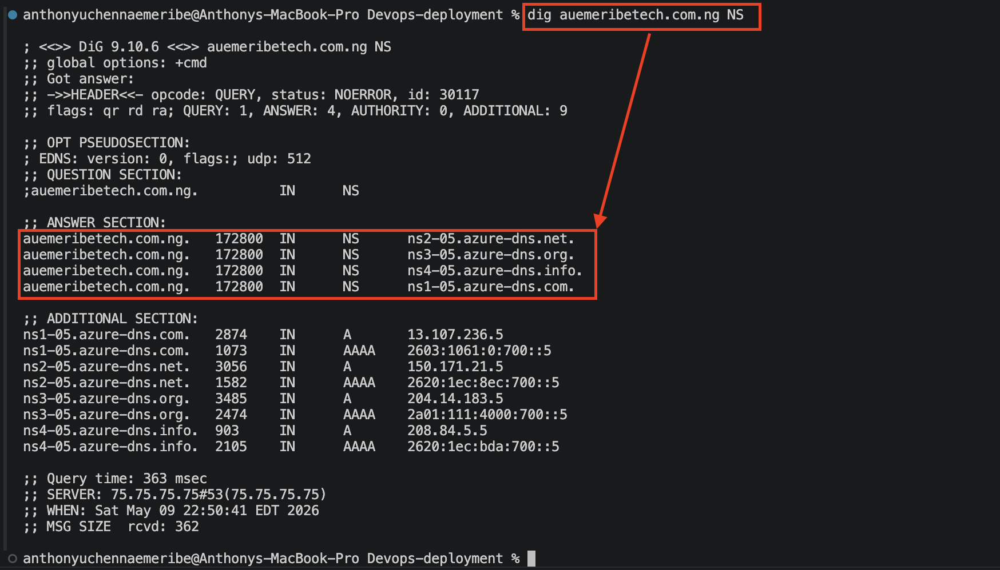
---

## Step 40 — Create Root Domain A Record

```bash
az network dns record-set a add-record --resource-group rg-php-devops --zone-name auemeribetech.com.ng --record-set-name @ --ipv4-address 20.106.122.173
```
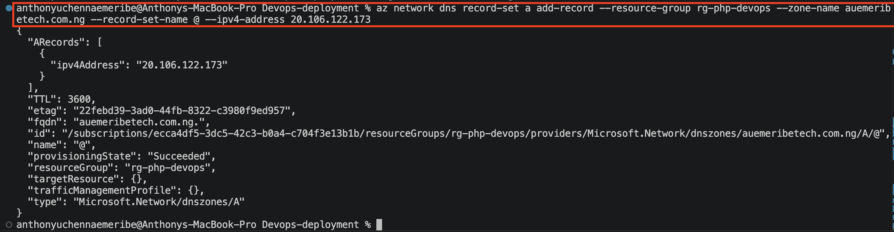
---

## Step 41 — Create WWW Record

```bash
az network dns record-set a add-record --resource-group rg-php-devops --zone-name auemeribetech.com.ng --record-set-name www --ipv4-address 20.106.122.173
```

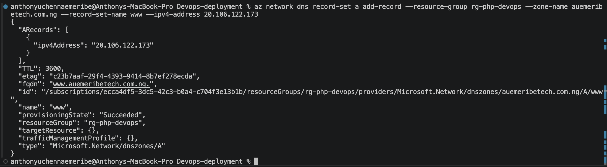

---

# PHASE 11 — CONFIGURE NGINX REVERSE PROXY (DOMAIN NAME CONFIGURATION IN NGINX)

---

## Step 42 — Install Nginx
1. Access the Azure VM
```bash
ssh azureuser@20.106.122.173
```


2. Run
```bash
sudo apt install nginx -y
```
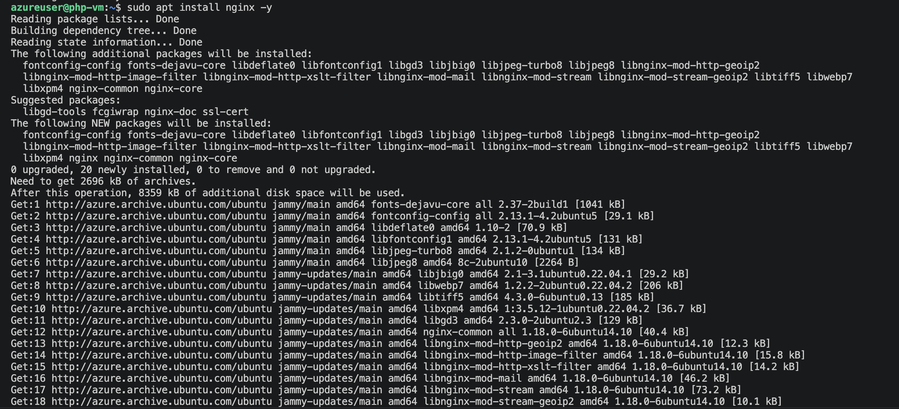
---

## Step 43 — Configure Reverse Proxy

Edit:

```bash
sudo nano /etc/nginx/sites-available/default
```

Replace contents with:

```nginx
server {

    listen 80;

    server_name app.auemeribetech.com.ng;

    location / {

        proxy_pass http://127.0.0.1:3000;

        proxy_set_header Host $host;

        proxy_set_header X-Real-IP $remote_addr;
    }
}
```

---

## Step 44 — Restart Nginx
1. Run:
```bash
sudo systemctl restart nginx
```
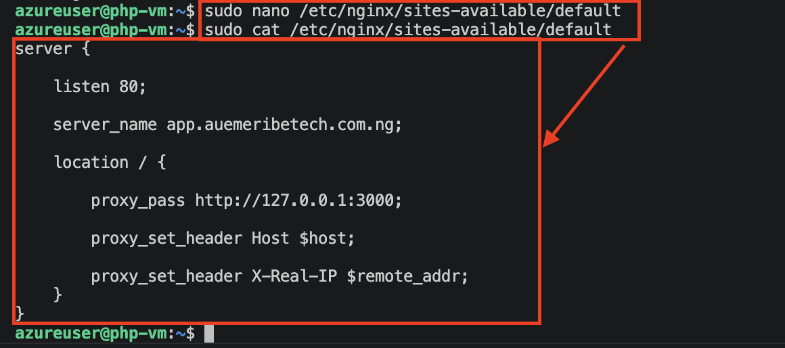

2. Verify:

```bash
sudo systemctl status nginx
```
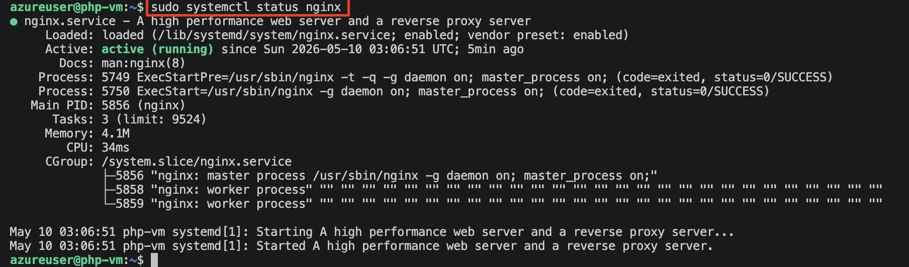

3. Restart Nginx:

```bash
sudo systemctl restart nginx
```
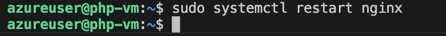

4. Test:

```text
http://www.auemeribetech.com.ng
```

---

# PHASE 12 — ENABLE HTTPS

---

## Step 45 — Install Certbot

```bash
sudo apt install certbot python3-certbot-nginx -y
```
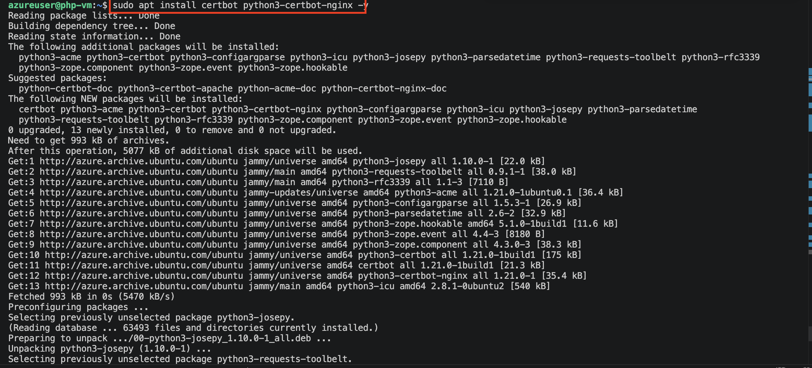
---

## Step 46 — Generate SSL Certificate

```bash
sudo certbot --nginx -d app.auemeribetech.com.ng
```

Choose:
- auemeribetech.com.ng
- www.auemeribetech.com.ng
- redirect HTTP to HTTPS


## Certbot SSL Failure — NXDOMAIN DNS Error

### Error

```text
Certbot failed to authenticate some domains

DNS problem: NXDOMAIN looking up A for app.auemeribetech.com.ng
```
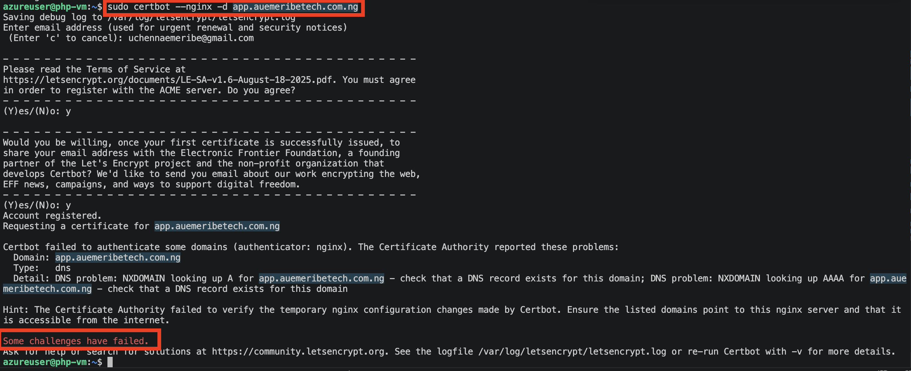
---

## Cause

The subdomain:

```text
app.auemeribetech.com.ng
```

did not exist in Azure DNS.

Certbot could not verify domain ownership because no DNS record pointed the domain to the Azure VM public IP.

---

## Troubleshooting Steps

### 1. Verify DNS Record

Run locally:

```bash
nslookup app.auemeribetech.com.ng
```

If DNS is not configured correctly, you may see:

```text
NXDOMAIN
```
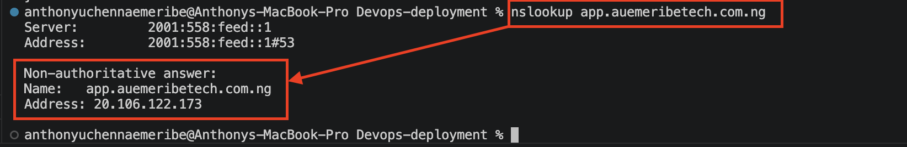
---

### 2. Create Azure DNS A Record

Run outside the VM on your local machine:

```bash
az network dns record-set a add-record --resource-group rg-php-devops --zone-name auemeribetech.com.ng --record-set-name app --ipv4-address YOUR_VM_PUBLIC_IP
```

Example:

```bash
az network dns record-set a add-record --resource-group rg-php-devops --zone-name auemeribetech.com.ng --record-set-name app --ipv4-address 20.106.122.173
```
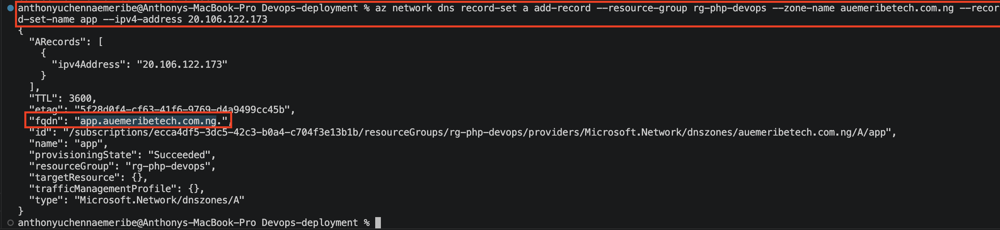
---

### Step 3 — Verify DNS Propagation

Run:

```bash
nslookup app.auemeribetech.com.ng
```

Expected:

```text
20.106.122.173
```

You can also verify using:

```bash
dig app.auemeribetech.com.ng
```

---

### Step 4 — Verify HTTP Access

Before generating SSL, ensure the application is reachable over HTTP:

```bash
curl http://app.auemeribetech.com.ng
```

---

### Step 5 — Retry Certbot

SSH into the Azure VM:

```bash
ssh azureuser@YOUR_VM_PUBLIC_IP
```

Run:

```bash
sudo certbot --nginx -d app.auemeribetech.com.ng
```

---

## Resolution

After creating the Azure DNS A record and waiting for propagation:

- DNS resolved successfully
- Certbot verified domain ownership
- SSL certificate was generated successfully
- HTTPS became active

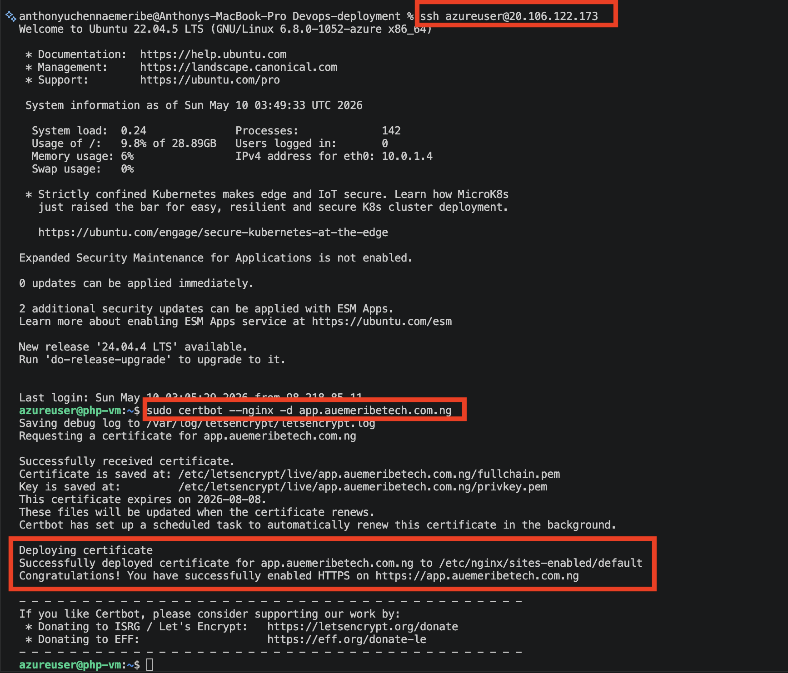
---

## Step 47 — Verify HTTPS

1. Open:

```text
https://app.auemeribetech.com.ng
```
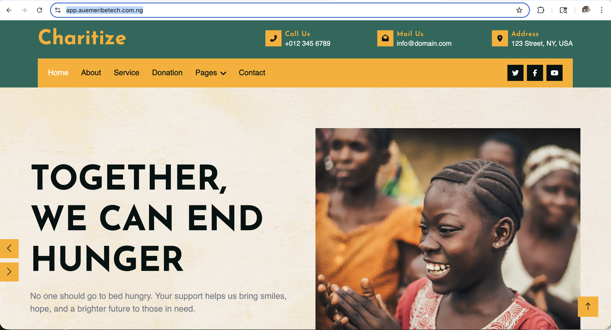

2. The Azure VM can now be exited to test the full CI/CD pipeline using
```bash
exit
```

---

# PHASE 13 — TEST FULL CI/CD PIPELINE

---

## Step 48 — Make Application Change

Edit:

```text
index.php
```

Add:

```text
AUEmeribe Tech Hub
```
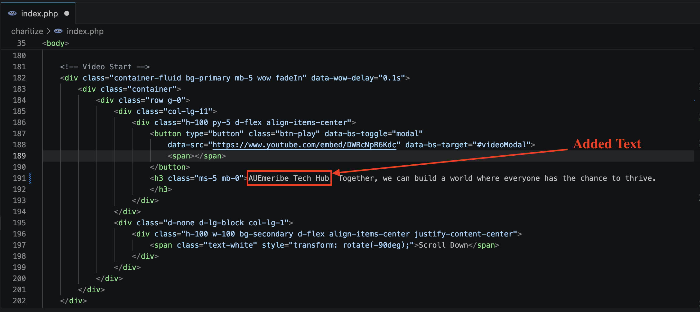
---

## Step 49 — Push Changes

```bash
git remote -v

git add .

git commit -m "Testing CI/CD deployment"

git push origin main
```
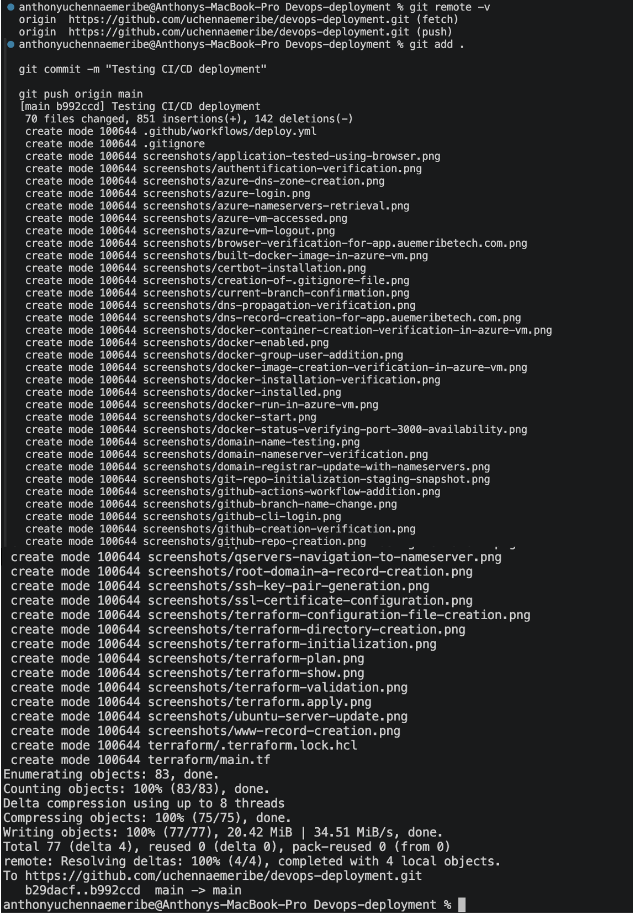
---

## Step 50 — Verify GitHub Actions

1. Go to:

```text
GitHub Repository
→ Actions
```

Watch pipeline execute automatically.

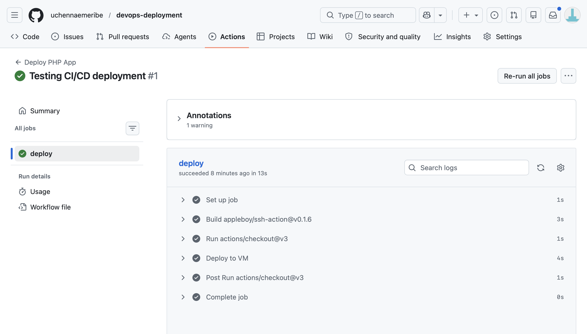
---

## Step 51 — Verify Live Application

Open:

```text
https://app.auemeribetech.com.ng
```
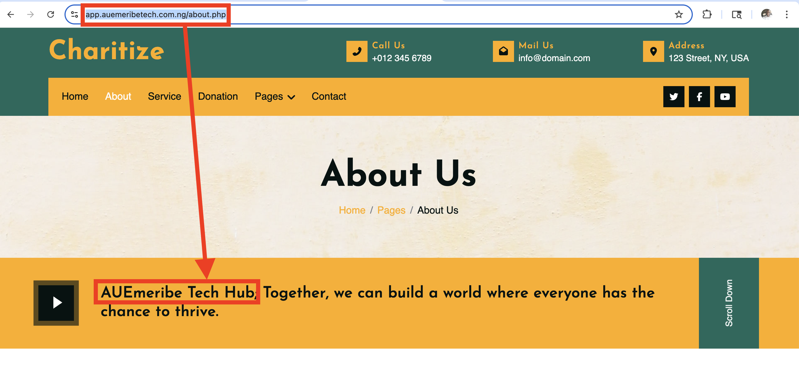
---

# PHASE 14 — DEVELOP PROJECT ARCHITECTURE DIAGRAM

---

## Step 52 — Create Documentation Folder

```bash
mkdir -p docs/achitecture-diagram.dot
touch docs/achitecture-diagram.dot
```

---

## Step 53 — Create Architecture Code File

Create:

```text
docs/architecture.dot
```

---

## Step 54 — Add Graphviz Architecture Code

Paste into:

```text
docs/architecture.dot
```

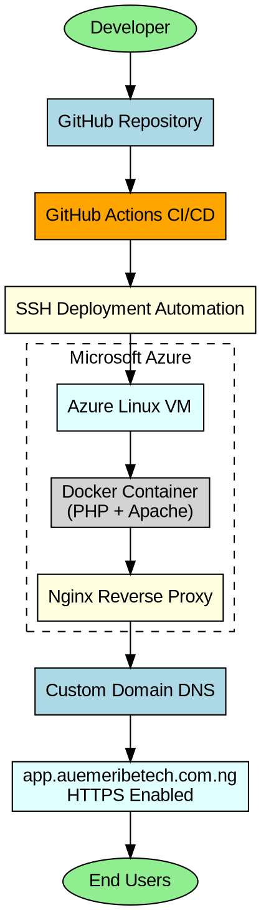
```dot
digraph DevOps_Deployment_Architecture {

    rankdir=TB;
    fontname="Arial";

    node [
        shape=box,
        style=filled,
        fontname="Arial"
    ];

    developer [
        label="Developer",
        shape=ellipse,
        fillcolor="lightgreen"
    ];

    github [
        label="GitHub Repository",
        fillcolor="lightblue"
    ];

    github_actions [
        label="GitHub Actions CI/CD",
        fillcolor="orange"
    ];

    ssh [
        label="SSH Deployment Automation",
        fillcolor="lightyellow"
    ];

    azure_vm [
        label="Azure Linux VM",
        fillcolor="lightcyan"
    ];

    docker [
        label="Docker Container\n(PHP + Apache)",
        fillcolor="lightgrey"
    ];

    nginx [
        label="Nginx Reverse Proxy",
        fillcolor="lightyellow"
    ];

    dns [
        label="Custom Domain DNS",
        fillcolor="lightblue"
    ];

    domain [
        label="app.auemeribetech.com.ng\nHTTPS Enabled",
        fillcolor="lightcyan"
    ];

    users [
        label="End Users",
        shape=ellipse,
        fillcolor="lightgreen"
    ];

    developer -> github;
    github -> github_actions;
    github_actions -> ssh;
    ssh -> azure_vm;
    azure_vm -> docker;
    docker -> nginx;
    nginx -> dns;
    dns -> domain;
    domain -> users;

    subgraph cluster_azure {
        label="Microsoft Azure";
        style=dashed;

        azure_vm;
        docker;
        nginx;
    }
}
```
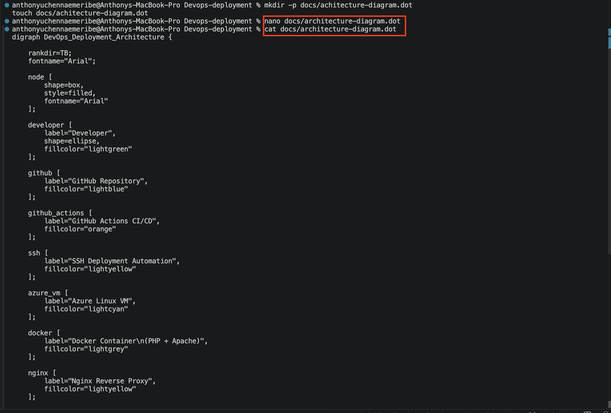
---

## Step 55 — Generate Architecture Diagram

Generate PNG:

```bash
dot -Tpng docs/architecture-diagram.dot -o docs/architecture-diagram.png
```
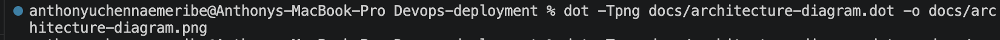
Generate SVG:

```bash
dot -Tsvg docs/architecture-diagram.dot -o screenshots/architecture-creation-svg-version.svg
```

---

## Step 53 — Open Architecture Diagram

```bash
open docs/architecture.png
```

---

## Step 56 — Add Diagram to README

```markdown
# Architecture Diagram
```
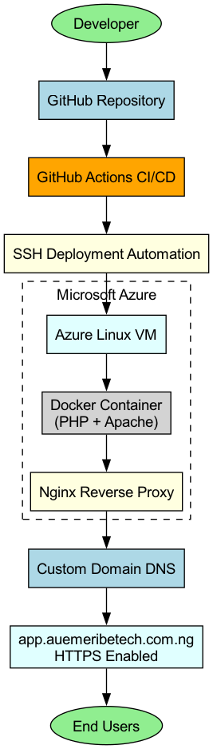
---

## Step 55 — Push Architecture Updates

```bash
git add .

git commit -m "Added architecture diagram"

git push origin main
```

---

# Common Errors and Fixes

---

## ERROR 1 — Terraform Large Files on GitHub

Fix:

```bash
git rm -r --cached terraform/.terraform
```

Then:

```bash
git add .
git commit -m "Remove terraform cache"
git push
```

---

## ERROR 2 — SSH Authentication Failure

Use PRIVATE key:

```bash
cat ~/.ssh/id_rsa
```

NOT:

```text
id_rsa.pub
```

---

## ERROR 3 — Docker Permission Denied

Fix:

```bash
sudo usermod -aG docker azureuser
```

Reconnect SSH.

---

## ERROR 4 — Port Conflict

Fix:

```bash
sudo docker run -d -p 3000:80 --name php-app php-app
```

Use Nginx reverse proxy.

---

## ERROR 5 — Docker Not Found

Fix:

```bash
sudo apt install docker.io -y
sudo systemctl start docker
```

---

# Final Outcome

You successfully built:

- Dockerized PHP Application
- Azure Infrastructure with Terraform
- Automated CI/CD Pipeline
- GitHub Actions Deployment
- SSH Automation
- Custom Domain Integration
- HTTPS Secure Application
- Production Reverse Proxy Architecture

---

# Cleanup Resources

1. Destroy Terraform infrastructure:

```bash
cd terraform

terraform destroy
```
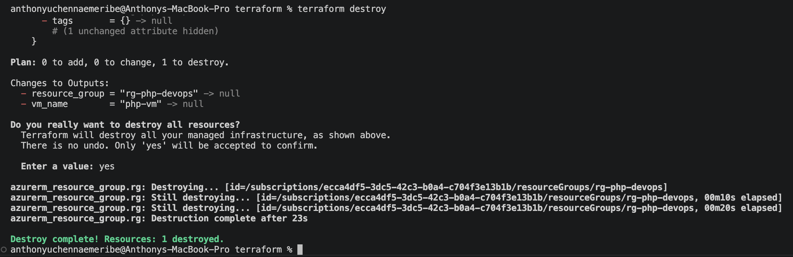

# Error Encountered and Troubleshooting

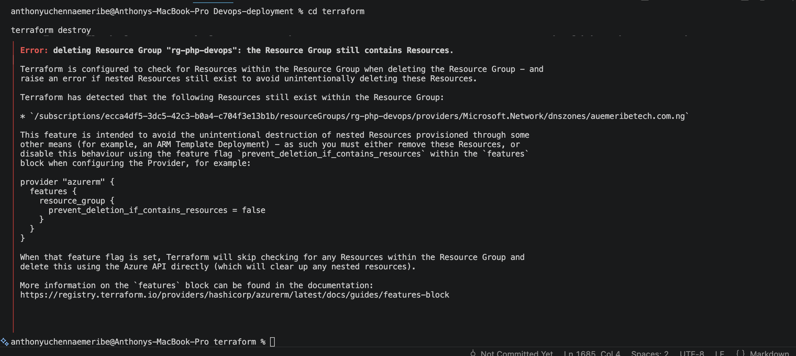

Troubleshooting

a. Delete the DNS zone manually first:
```bash
az network dns zone delete --resource-group rg-php-devops --name auemeribetech.com.ng --yes 
```


b. Verify deletion:
```bash
az resource list --resource-group rg-php-devops --output table
```
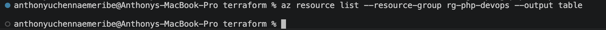

c. Delete Azure watcher resource group:

```bash
az group delete -n NetworkWatcherRG -y
```

---

# Author

Anthony Uchenna Emeribe

Cloud / DevOps Engineer